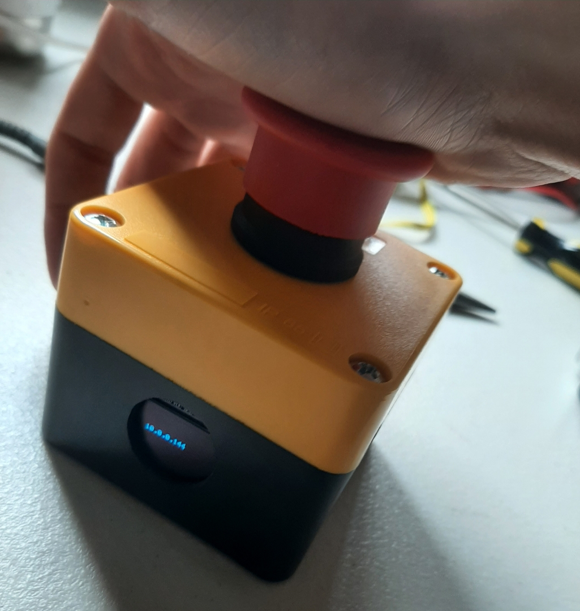
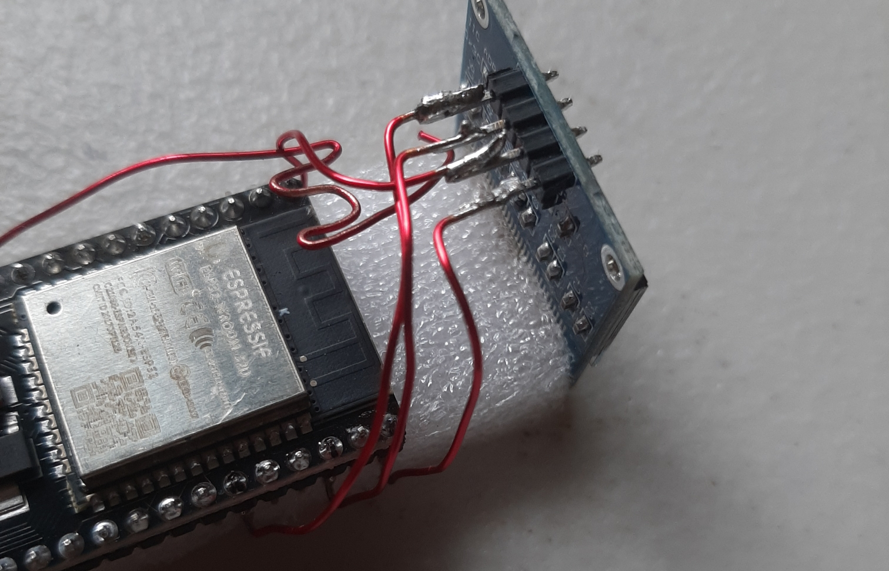
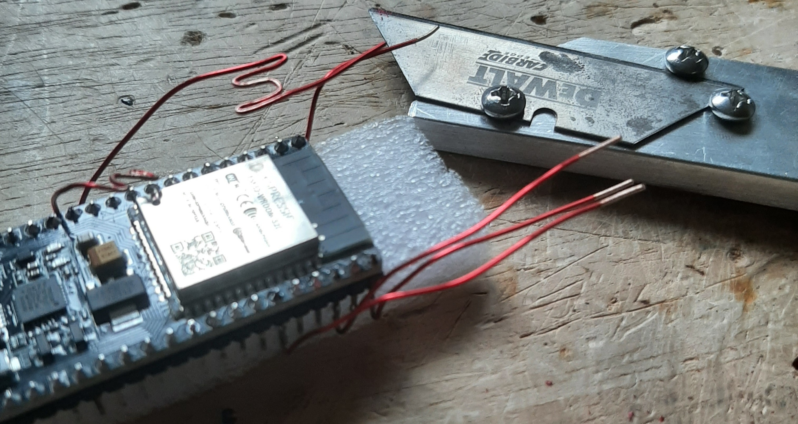
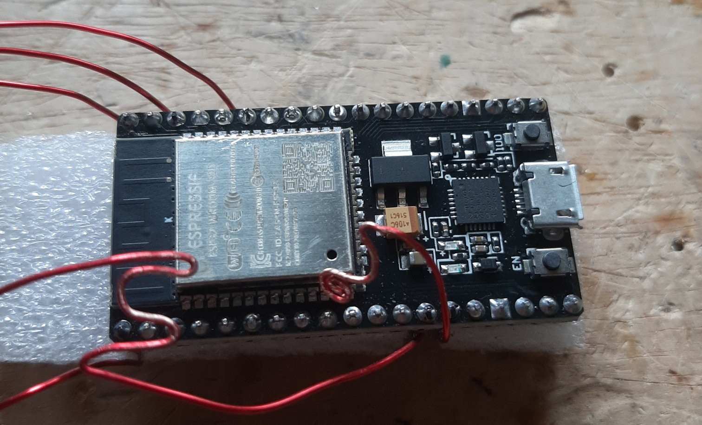
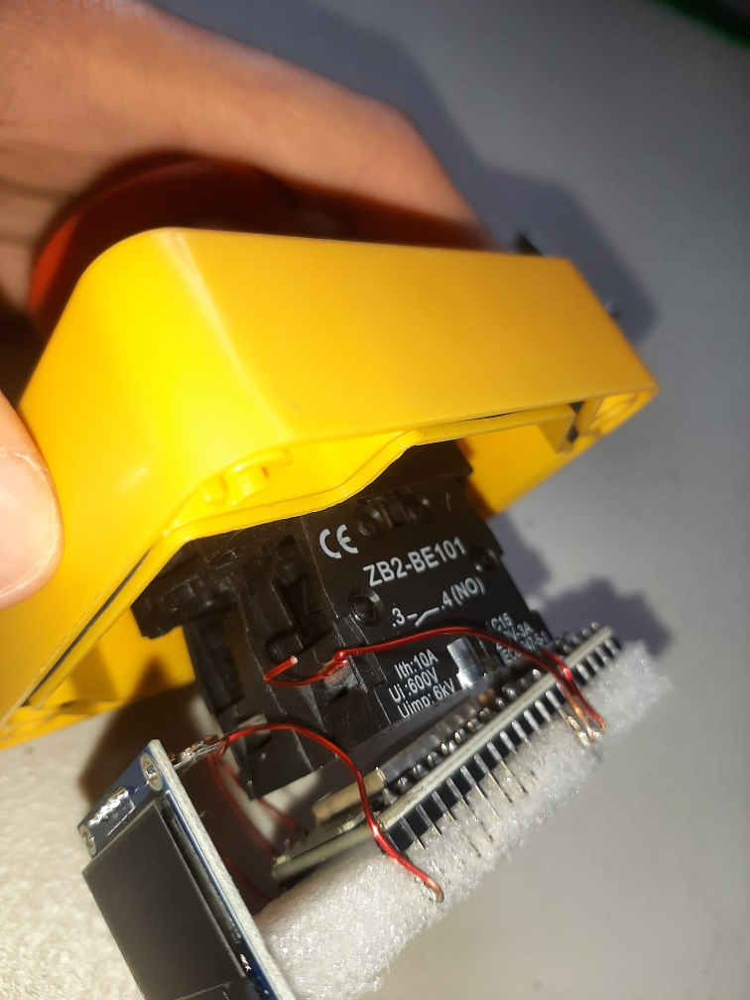
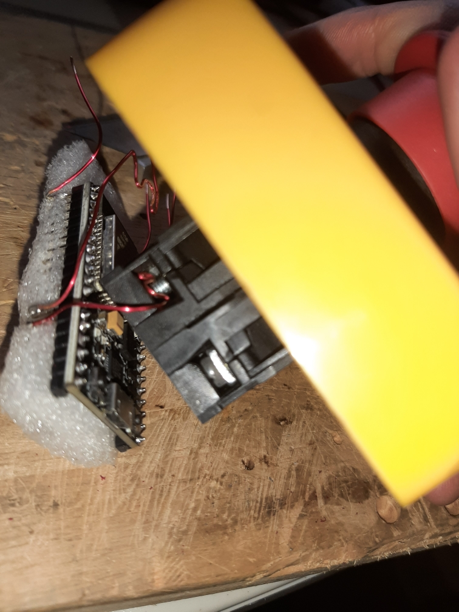
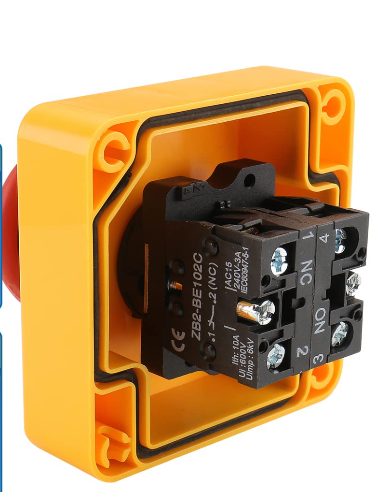

# Time Tracking Big Red Button
A big red button that, when pressed, documents the current time and date and displays it on a local network website.

When the button is pressed, the screen displays the IP address for 1 second to confirm the press. Going to that IP address, on your browser, displays the last 15 times the button was pressed. This information is reset when the power cuts out.



## Instructions
1. Wire everything up
	- The final product should be soldered, but it would be best to test first on a bread board.
	- Wiring diagram
		- Button wiring
			- Pin 13(GIOP12) connects to one side of the Normally Open(NO) side of the button.
			- Pin 14(GND) connects to the other side of the Normally Open(NO) side of the button.
		- Screen wiring
			- Pin 38(GND) connects to GND pin of the screen.
			- Pin 1(3.3V) connects to VCC pin of the screen.
			- Pin 36(GIOP22) connects to SCL pin of the screen.
			- Pin 33(GIOP21) connects to SDA pin of the screen.
			- 
	- For best results, remove the enamel from the copper wires using a utility knife.
		- 
	- Fold up the ends of the wiring going into the button to ensure a better fit.
		- 
		-  
1. Upload the [final script](./final_script.ino) and test
	- Replace the `ssid` and `pass` variables with your Wi-Fi information.
1. Mount in case
	- There are very tight tolerances, for the height, to get the case to close properly.
		- Sand down the bottom of the top half of the big red button to allow it to fit into the case.
			- 
		- Make sure the wires soldered on the ESP 32 don't add additional height.
	- Remove the front and back ports on the bottom half of the big red button.
	- It is recommended to use a piece of foam to make sure everything fits snugly.

## Products used
- Micro USB cable that supports data transfer
- [Big red button](https://www.amazon.com/dp/B078SWQD8K?psc=1&ref=ppx_yo2ov_dt_b_product_details)
- [OLED display](https://www.amazon.com/Hosyond-Display-Self-Luminous-Compatible-Raspberry/dp/B09C5K91H7/ref=sr_1_12_sspa?sr=8-12-spons&sp_csd=d2lkZ2V0TmFtZT1zcF9tdGY&psc=1)
- [ESP 32](https://www.amazon.com/dp/B0718T232Z?psc=1&ref=ppx_yo2ov_dt_b_product_details)
- [22 AWG Copper Enameled Wire](https://www.amazon.com/BNTECHGO-AWG-Magnet-Wire-Transformers/dp/B07DYF89T9/ref=sxin_15_pa_sp_search_thematic_sspa?cv_ct_cx=22%2Bcopper%2Benameled%2Bwire&pd_rd_i=B07DYF53ZN&sbo=RZvfv%2F%2FHxDF%2BO5021pAnSA%3D%3D&sr=1-1-364cf978-ce2a-480a-9bb0-bdb96faa0f61-spons&sp_csd=d2lkZ2V0TmFtZT1zcF9zZWFyY2hfdGhlbWF0aWM)
- Soldering iron

## Uploading to [ESP 32](https://www.amazon.com/gp/product/B0718T232Z/ref=ppx_yo_dt_b_asin_title_o00_s01?ie=UTF8&psc=1)
1. Download Arduino IDE
2. File -> Preferences -> Additional boards manager URLs: `https://dl.espressif.com/dl/package_esp32_index.json`
3. Boards Manager -> esp32 Install
4. In terminal
```
sudo adduser <username> dialout
sudo chmod a+rw /dev/ttyUSB0
```
5. Select `NodeMCU-32S` board
